# Kingdom for a Word!
Developer: Karol Mileszko

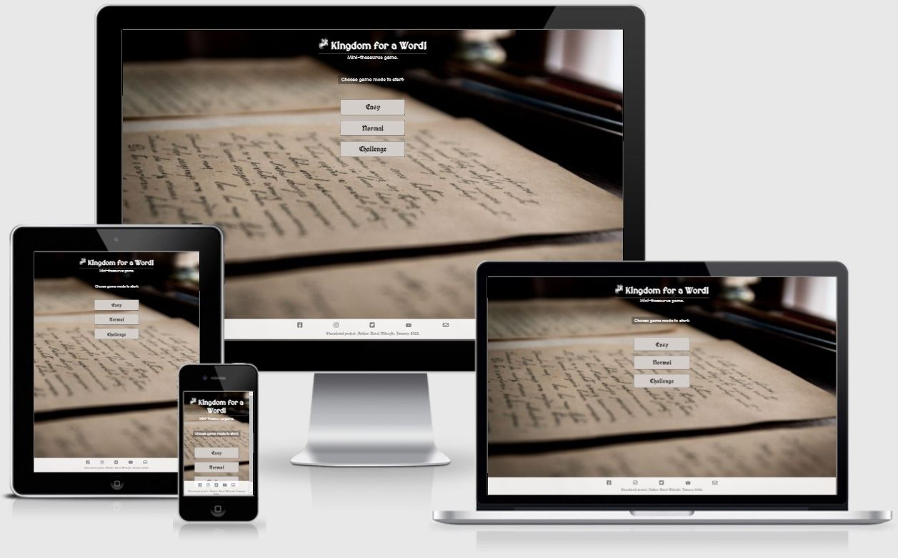

[Live webpage](https://karmiles.github.io/kingdom-for-a-word/)

## Table of content

1. [Introduction](#introduction)
2. [Plane 1. Strategy](#plane-1-strategy)
    1. [Project Goals](#project-goals)
    2. [User Experience UX](#user-experience-ux)
        1. [User stories](#user-stories)
        2. [Focus](#focus)
3. [Plane 2. Scope](#plane-2-scope)
    1. [Objective requirements](#objective-requirements)
    2. [Functional specifications](#functional-specifications)
    3. [Content requirements](#content-requirements)
    4. [Project rollout](#project-rollout)
4. [Plane 3. Structure](#plane-3-structure)
    1. [Prioritisation](#prioritisation)
    2. [Semantic sections](#semantic-sections)
5. [Plane 4. Skeleton](#plane-4-skeleton)
6. [Plane 5. Surface](#plane-5-surface)
    1. [Design choices](#design-choices)
    2. [Colour](#colour)
    3. [Fonts](#fonts)
    4. [Structure](#structure)
7. [Technologies used](#technologies-used)
8. [Frameworks Libraries and Programs used](#frameworks-libraries-and-programs-used)
    1. [Tools used](#tools-used)
    2. [Features applied](#features-applied)
9. [Deployment](#deployment)
10. [Testing](#testing)
    1. [Validators](#validators)
        1. [W3C Markup Validator](#w3c-markup-validator)
        2. [W3C CSS JigSaw Validator](#w3c-css-jigsaw-validator)
        3. [JS Hint Validator](###-js-hint-validator)
    2. [User Experience UX testing](#user-experience-ux-testing)
        1. [Visibility and functionality](#visibility-and-functionality)
        2. [Accessibility](#accessibility)
        3. [Performance](#performance)
        4. [Browser compatibility](#browser-compatibility)
        5. [Testing user stories](#testing-user-stories)
11. [Bugs and changes to original design](#bugs-and-changes-to-original-design)
12. [Credits](#credits)
    1. [Code](#code)
    2. [Media](#media)
    3. [Acknowledgements](#acknowledgements)

## Introduction
**The idea for the project**

The purpose of this webpage is to entertain the visitor with a word game. The aim of the game is to enter a word similar in meaning to the one shown on the page. If the word entered by the visitor is contained in the English Thesaurus the visitor gets a point. Both succesful and failed guesses are scored and shown on the page.   

**Project preparation**

The site was designed using the Five Planes of User Experience approach. This document follows the steps taken during the preparation of the site, going from the most abstract to the most concrete.

# Plane 1 Strategy
## Project goals
### Owner goals
- Provide online entertainment in the form of a word game.

## User Experience UX

### User stories

First Time Visitor goals:

1. **End user goal:** As a First Time Visitor I want that the site is easy to use. **Owner goal:** As the site Owner I want to provide a game that is intuitive to use. **Acceptance criteria:** Game is easy to learn and immediately engaging. No lengthy instructions are necessary.

First Time or Returning Visitor Goals:

2. **End user goal:** As a Visitor I want entertainment which would benefit me in some way.  **Owner goal:** As the site Owner I want to provide additional value to user through an educational aspect of the game. **Acceptance criteria:** Game draws on widely accepted source of knowledge and lets user draw on that. 
3. **End user goal:** As a Visitor I want to know my progress in the game at all times. **Owner goal:**  As the site Owner I want to keep user engaged through a feedback mechanism. Build and maintain visitor loyalty through increased engagement. **Acceptance criteria:** Game provides score visible at all times. 
4. **End user goal:** As a Visitor I want to be able to access the game on various kinds of devices. **Owner goal:**  As the site Owner I want to maintain customer engagement in various kinds of situations, when stationary (pc screen) or on the move (tablets and smartphones). **Acceptance criteria:** Site utilizes mechanisms of responsive desing. 

### Focus
I calculated the Focus ratio by multiplying Importance and Viability and normalised the results. This enabled me to compare every Opportunity on a scale of 0-100%. The higher the number the more crucial it is for the Opportunity to be addressed. Importance and Feasibility spectrum is perfectly illustrated on Code Institute graph below; Opportunities with high factor of both importance and viability would find themselves on the top right corner of the graph (red area). 

    
Importance / Viability graph

    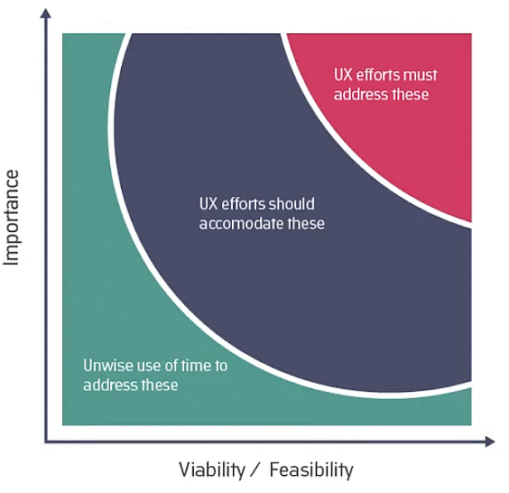

| No. | Opportunity / problem                                        | Importance (1 - 5 most important) | Viability / Feasibility (1– 5 most difficult) | Focus ratio |
| --- | ------------------------------------------------------------ | --------------------------------- | --------------------------------------------- | ----------- |
| 1   | Provide entertainment for the visitor                        | 5                                 | 5                                             | 100%        |
| 2   | Provide a challenge in the knowledge of the English language | 4                                 | 5                                             | 80%         |
| 3   | Provide educational element in the English language          | 3                                 | 4                                             | 48%         |

Basing on the above analysis the initial roll-out follows on opportunities 1 through 3 as important and feasible and as such are addressed in the project. 

**Definition**
The website is a recreational site providing entertainment with educational elements within English language scope.

**Value**
Value for the owner is providing light-harted entertainment. 
Value for the visitor is engaging in a simple game with an educational element.

# Plane 2 Scope
## Objective requirements
The visitor wants a site which will provide entertainment and is easy to use.

## Functional specifications
- Site shows random words.
- Visitor enters words that are similar in meaning (or otherwise related to the shown word) using keyboard. 
- After pressing the Submit button or Enter key on keyboard by visitor the word is checked on it's appearance in the thesaurus. 
- Score of successful and unsuccessful tries is kept and shown on the page for the duration of the game.

## Content requirements
Website needs to contain:
- Explanation on nature of the game.
- Game part.
- Score.

## Project rollout
All opportunities listed in the Focus section are expected to be realized in the initial rollout.

# Plane 3 Structure
## Prioritisation
The elements of the project are prioritised in the following order:
1. Provide entertainment for the visitor
2. Provide a challenge in the knowledge of the English language
3. Provide educational element in the English language

## Semantic sections
Webpage has three main semantic sections: 
1. Header: contains the title of the game and doesn't change.
2. Main section: contains two subpages:
    * Introduction and difficulty choice
    * Game part with random word, text area for Visitor's word, Submit button and score.
3. Footer: containing links to Owner's social media platforms and information about the site.

# Plane 4 Skeleton

Site low-fidelity prototypes (wireframes) were created in three versions for various screen sizes: small/smartphone, medium/tablet and large/PC to maintain website responsiveness on various screen sizes:

    
Starting page

    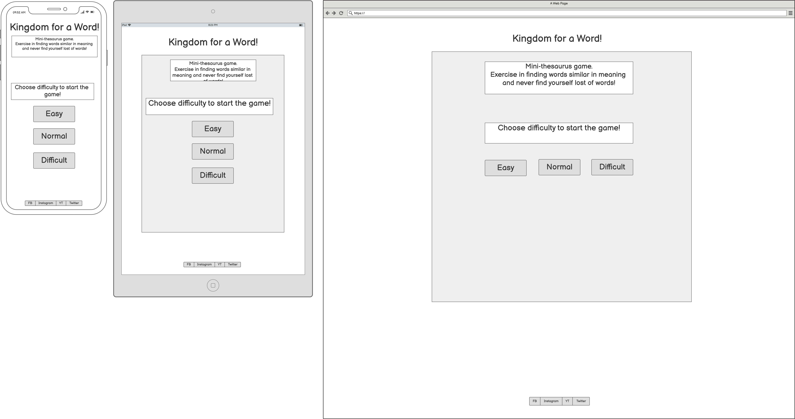

    
Game page

    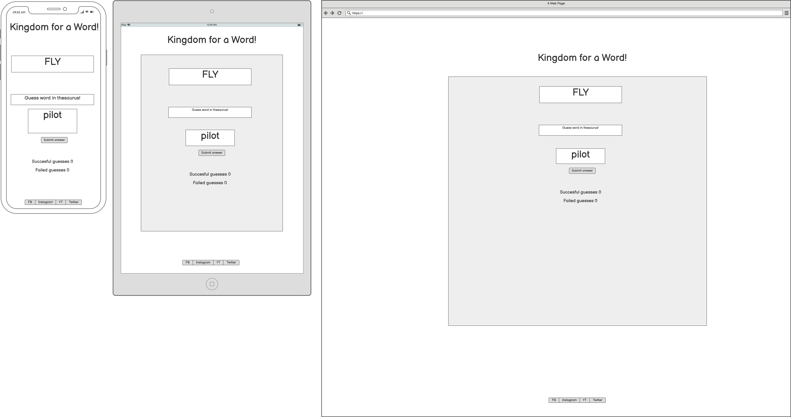

# Plane 5 Surface

## Design choices
The intention behind building the sensory design for the site is focusing on a light-harted approach to playing with words. Graphic design draws on historic letters and vintage paper. This design is in line with the name of the game "Kingdom for the Word!" losely based on the words in Shakespeare's play "Richard III". 

## Colour
Colour palette applied in the site is inspired by the looks of vintage paper and hand-written and gothic letters.

    
Colour palette

    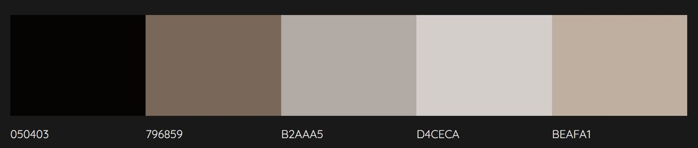

## Fonts
Fonts used on the website are 
- UnifrakturCook
- MedievalSharp
## Structure
The website is structured in a simple, user friendly manner. Starting page briefly explains rules of the game and lets the visitor chose level of the game. After chosing difficulty the game page shows. This is where the score is also shown. The player can always go back by clicking the title of the game.

# Technologies used
This project has been realised using the following technologies:
* HTML5
* CSS3
* JavaScript

# Frameworks Libraries and Programs used
## Tools used
This project has been realised using the following frameworks, programs and webpages:
* Git - for version control
* [GitHub](https://github.com/) - for storing the project's code and other files
* [Visual Studio Code](https://code.visualstudio.com/) - for writing the code and documents
* [Balsamiq](https://balsamiq.com/) - for wireframes creation
* [Google Fonts](https://fonts.google.com/)
* [Table to Markdown](https://tabletomarkdown.com) - for converting tables to markdown format.
* [W3 School](https://www.w3schools.com/) - for web development coding solutions
* [Stack Overflow](https://stackoverflow.com/) - for web development coding solutions
* [IrfanView](https://www.irfanview.com/) - for graphics editing
* [Pixlr](https://pixlr.com/) - for graphics editing

# Deployment
The site is deployed to GitHub pages, using also GitHub repository, GitHub clone and GitHub branch methods as needed. On local computer Visual Studio Code program was used.

GitHub deployment:
1. After logging in to GitHub go to chosen GitHub repository (GitHub Repository for this project: https://github.com/KarMiles/campervan-adventures),
2. Go to Settings (top right),
3. Select Pages (menu on the left),
4. In Source section select Branch: main,
5. After the page refreshes automatically the confirmation appears (in case of this project: Your site is published at https://karmiles.github.io/campervan-adventures/).

Repository may be forked in the following steps:
1. Go to GitHub repository,
2. Click Fork button (top right).

Steps for cloning repository:
1. Go to GitHub repository,
2. Click Code button (top right above files list),
3. Select cloning method option: HTTPS, SSH or GitHub CLI and click Copy button (right side of the text box) to copy URL to clipboard,
4. Open Git Bash (Git Bash can be downloaded from https://git-scm.com/downloads),
5. In Git Bash change working directory to the desired destination for the clone,
6. Type "git clone", paste URL for SSH method from the clipboard (in this project: git clone git&#8203;@github.com:KarMiles/kingdom-for-a-word.git) and press Enter.

# Testing
## Validators

The following validators were used for testing code correctness:
### W3C Markup Validator 

No errors or warnings were found by [W3C Markup Validator](https://validator.w3.org/)  throughout the site.

    
Starting page

    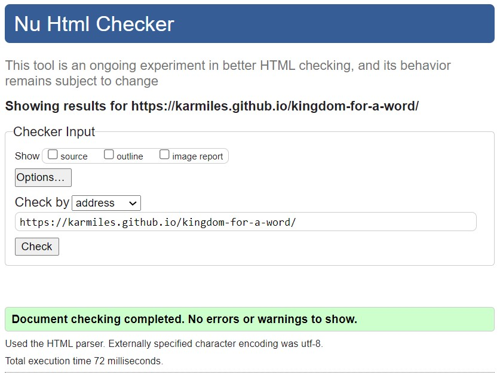

    
Contact

    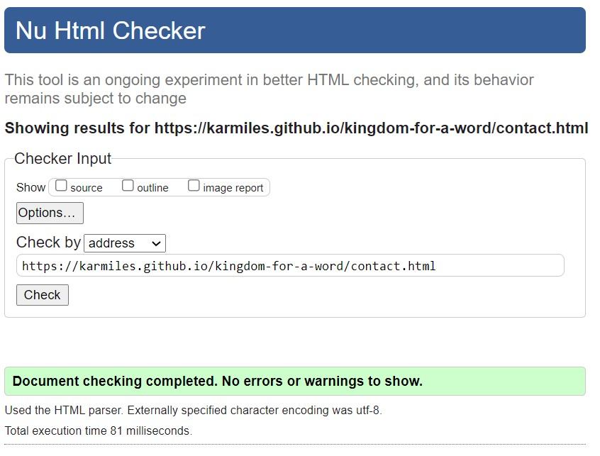

    
404

    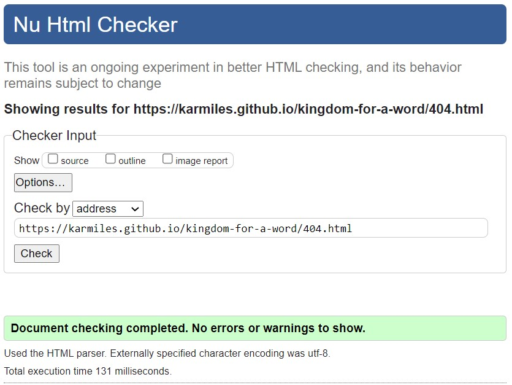

### W3C CSS Jigsaw Validator
No errors were found by [W3C CSS Jigsaw Validator](https://jigsaw.w3.org/css-validator).

    
CSS Validation

    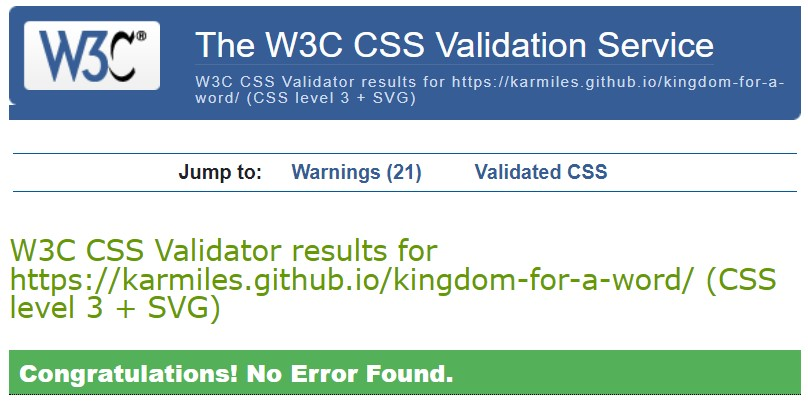

### JS Hint Validator
No errors. Warnings are mainly related to browsers versions compatibility and are considered acceptable.

    
JavaScript Validation

    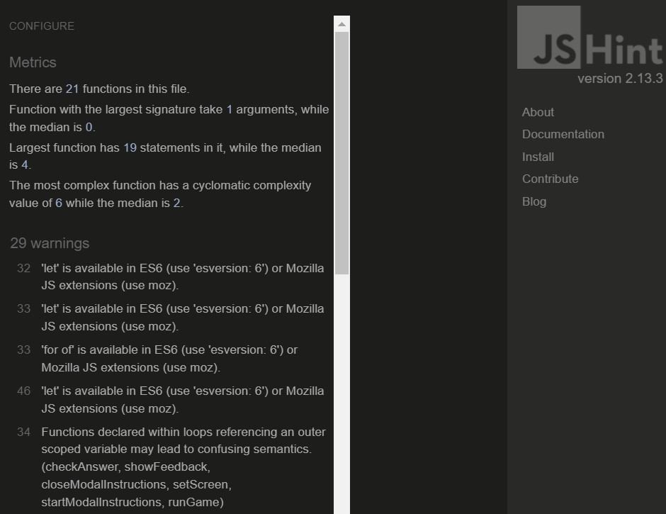

## User Experience UX testing

### Visibility and functionality
Optimal visibility and functionality on various devices was tested throughout the production process and the finished product was tested using [Responsive Designs](http://ami.responsivedesign.is). Screen from this test is placed in the beginning of this document.

### Accessibility
Testing for accessibility of the site was carried out with the employment of [WAVE Web Accessibility Evaluation Tool](https://wave.webaim.org/). No errors were found. Alerts were addressed where needed.

    
Home

    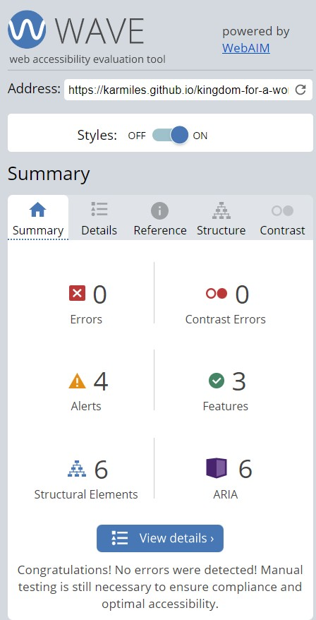

    
Contact

    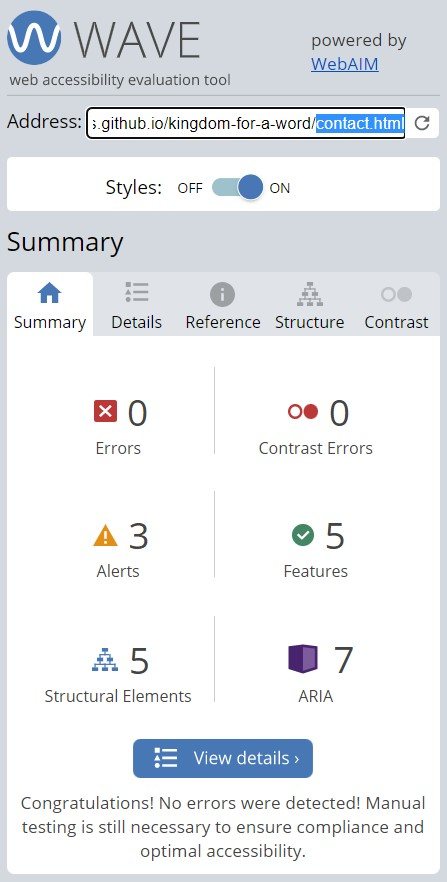

    
404

    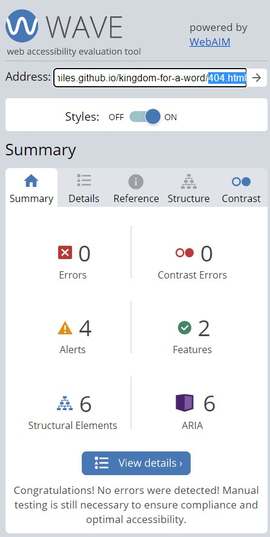

### Performance
Performance testing was done in [Lighthouse](https://developers.google.com/web/tools/lighthouse), part of the Google Chrome Developer Tools.
 All performance tests ended with score between 90-100.

    
Home

    

    
Contact

    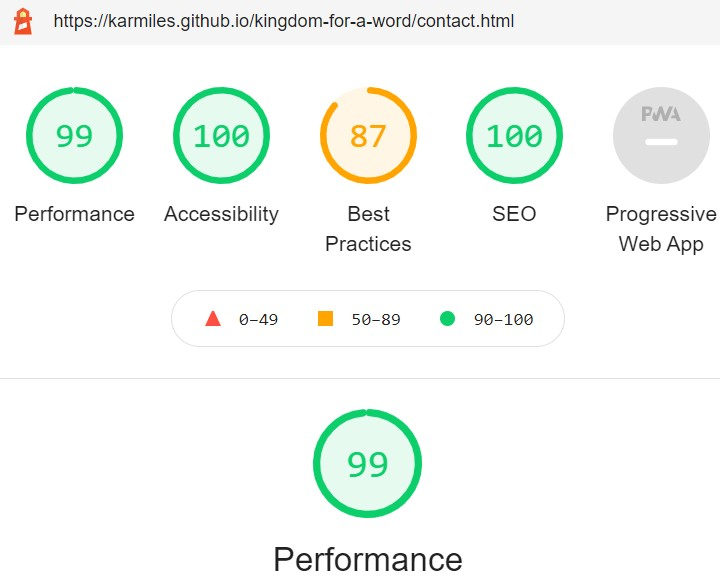

    
404

    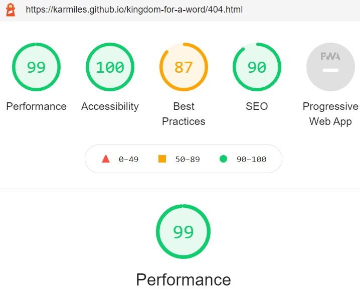

### Browser compatibility
The website was tested on browsers:
- Google Chrome
- Microsoft Edge
- Mozilla Firefox
- Opera

### Testing user stories
1. **End user goal:** As a First Time Visitor I want that the site is easy to use. **Owner goal:** As the site Owner I want to provide a game that is intuitive to use. **Acceptance criteria:** Game is easy to learn and immediately engaging. No lengthy instructions are necessary.

| Feature                                           | Action                                                                                                    | Expected result                                                                | Actual result |
| ------------------------------------------------- | --------------------------------------------------------------------------------------------------------- | ------------------------------------------------------------------------------ | ------------- |
| Choice of game versions is immediately available. | Click on the button showing game version.                                                                 | Visitor clearly knows the choice they may make.                                | As expected.  |
| Choice of game version is clear and easy to make. | Make the choice for the game by clicking the appropriate button                                           | Visitor receives feedback with information concerning the chosen game version. | As expected.  |
| Show instructions for extra clarity.              | After making the choice for the first time a notification is shown with a brief introduction to the game. | Modal with game instructions add clarity on nature of the game.                | As expected.  |

First Time or Returning Visitor Goals:

2. **End user goal:** As a Visitor I want entertainment which would benefit me in some way.  **Owner goal:** As the site Owner I want to provide additional value to user through an educational aspect of the game. **Acceptance criteria:** Game draws on widely accepted source of knowledge and lets user draw on that. 

| Feature                                                                             | Action                                                                                    | Expected result                                                                                                               | Actual result |
| ----------------------------------------------------------------------------------- | ----------------------------------------------------------------------------------------- | ----------------------------------------------------------------------------------------------------------------------------- | ------------- |
| Provide historical background for the game                                          | On first load show information on instructions modal.                                     | After first starting the page a modal with information shows.                                                                 | As expected.  |
| Include words sources from prestigious linguistic institution (Collins Dictionary). | Words entered by visitor are checked against the list sourced from The Collins Thesaurus. | User input is validated against the highest quality word source. Feedback is given if user choice matches the Thesaurus list. | As expected.  |

3. **End user goal:** As a Visitor I want to know my progress in the game at all times. **Owner goal:**  As the site Owner I want to keep user engaged through a feedback mechanism. Build and maintain visitor loyalty through increased engagement. **Acceptance criteria:** Game provides score visible at all times.

| Feature                                                                                                               | Action                                                                                                                                                                                                                                                                            | Expected result                                                                                                | Actual result |
| --------------------------------------------------------------------------------------------------------------------- | --------------------------------------------------------------------------------------------------------------------------------------------------------------------------------------------------------------------------------------------------------------------------------- | -------------------------------------------------------------------------------------------------------------- | ------------- |
| Answer message provides information on which try the visitor is going to enter and the number of entries in the game. | To ensure responsiveness, the information is updated on every step, with every try.                                                                                                                                                                                               | Visitor is never loss on which part of the game they currently are thanks to the confirmation above entry box. | As expected.  |
| Feedback modal showing after visitor enters their guess.                                                              | Modal with feedback notifying whether the last guess was successful is shown after visitor enters their guess.                                                                                                                                                                    | Visitor gets notification on game progress and knows how they are progressing.                                 | As expected.  |
| End of game feedback.                                                                                                 | After entering set number of words, depending on game version, a screen with  notification on game result is presented. Visitor receives validation also on the last stage, with confirmation of number of wins, number of games in the session and overall result (win or lose). | Visitor has clear information on outcome of the game.                                                          | As expected.  |

    
 Screenshots 

    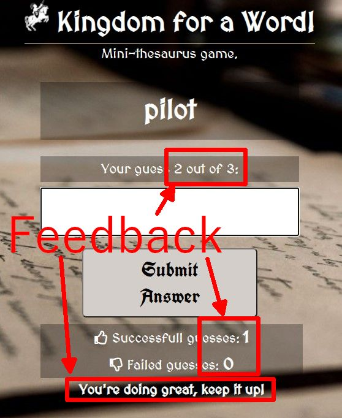

    
 Screenshots 

    

    
 Screenshots 

    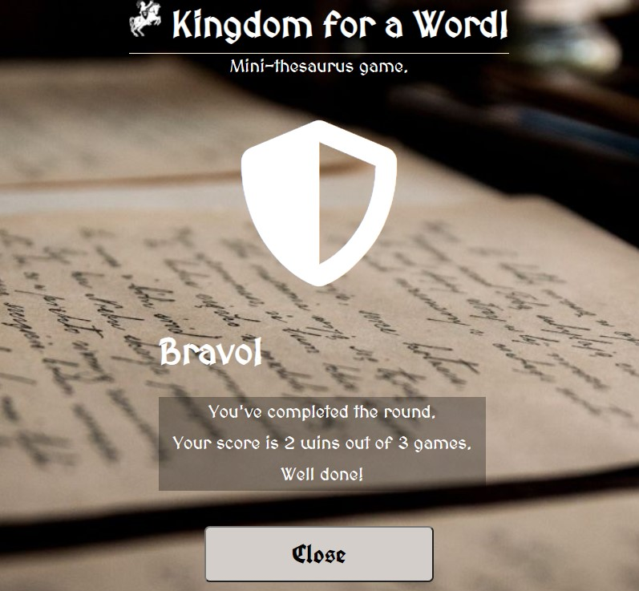

4. **End user goal:** As a Visitor I want to be able to access the game on various kinds of devices. **Owner goal:**  As the site Owner I want to maintain customer engagement in various kinds of situations, when stationary (pc screen) or on the move (tablets and smartphones). **Acceptance criteria:** Site utilizes mechanisms of responsive desing.
 
| Feature                               | Action                                                                                                                                                                    | Expected result                                        | Actual result |
| ------------------------------------- | ------------------------------------------------------------------------------------------------------------------------------------------------------------------------- | ------------------------------------------------------ | ------------- |
| Apply responsive design where needed. | Page is correctly visible and the game is playable on various kinds of screens and devices. Ensure responsiveness and instructiveness is maintained on various platforms. | Game is playable on various browsers and screen sizes. | As expected.  |

5. As a Visitor I want to be able to contact the author of the game.

| Feature                                   | Action                                                       | Expected result                                              | Actual result |
| ----------------------------------------- | ------------------------------------------------------------ | ------------------------------------------------------------ | ------------- |
| Form for sending emails to the site owner | Navigate to Contact page and fill the email form.            | Means of contact provided.                                   | As expected.  |
| Footer                                    | At the bottom of the page click on chosen social media link. | Opens new window or tab with company’s social media profile. | As expected.  |

    
 Screenshots 

    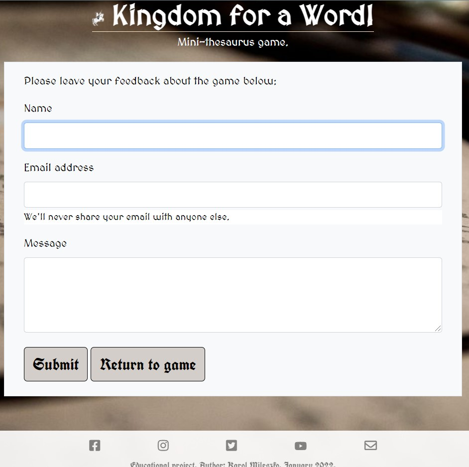

6.	**End user goal:** As a Visitor I want that the site is usable even in case of unexpected errors. **Owner goal:** As the site owner I want to maintain page responsiveness and good impression on the visitor even in case an error occurs.

| Feature  | Action                                                                                                               | Expected result                                                                                                                                                                      | Actual result |
| -------- | -------------------------------------------------------------------------------------------------------------------- | ------------------------------------------------------------------------------------------------------------------------------------------------------------------------------------ | ------------- |
| 404 page | In case an unavailable page is called, the user is presented with 404 error page with the link to the starting page. | User does not need to use browser back button. Page maintains interctiveness despite error, User receives notification about error and a possibility to go back to the welcome page. | As expected.  |

    
 Screenshots 

    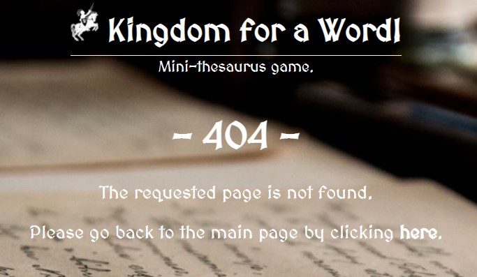

# Bugs and changes to original design
During realisation of the project the following obstacles were met and changes to original design introduced:
* Reference to a variable currentRandomWord didn't work, despite testing via console.log(currentRandomWord) showing appropriate value. Problem was in dot notation. Changing to traditional bracket notation solved the problem.
* Second modal on the page, containing feedback, was not working as expected. Decided on replacing modal with additional screen.
* Email sending mechanism not sending emails. Fixed by getting appropriate user, service and template IDs from EmailJS service.
* Contact page generating script error messages in console, despite all functionality working as expected. Not resolved at time of writing.
* Added functionality for user pressing Enter key. Works as expected on input box. Does not work as expected on Close buttons. Abandoned due to other priorities for this release.
# Credits
## Code
[Bootstrap](https://getbootstrap.com) - email form functionality

[EmailJS](https://www.emailjs.com/) - email functionality

Form for the user to write the email is based on Bootstrap. This is the functionality the visitor uses on the webpage. The email is then relayed through EmailJS service to the email address indicated by the site owner. This is based on site owner's account with EmailJS.
The mechanism has been tested and the site owner receives messages sent from the game Contact page.  
## Media

[Colormind](http://colormind.io) – color palette creation  

    
colour palette

    

[Font Awesome](https://fontawesome.com/) - sourcing icons

[Favicon Generator](https://favicon.io/favicon-generator/) - favicon creation

[Pikwizard](https://pikwizard.com/) - stock photographs

[Unsplash](https://unsplash.com) - stock photographs

[Biblioteka w Szkole](https://www.bibliotekawszkole.pl/) - source image for logo

[Code Institute](https://learn.codeinstitute.net/) - educational material

    
 feasibility-graph 

    

[Collins Dictionary](https://www.collinsdictionary.com/dictionary/english-thesaurus) - sourcing words for the game

Other media are property of the developer.

## Acknowledgements
I would like to thank everyone who contributed to development of this project, especially:
- My mentor Mo Shami for his invaluable guidance and advice.
- Educational Team at [Code Institute](https://codeinstitute.net/) for all educational materials which made this project possible.
- All visual artists and coders who make products of their work available to others online.