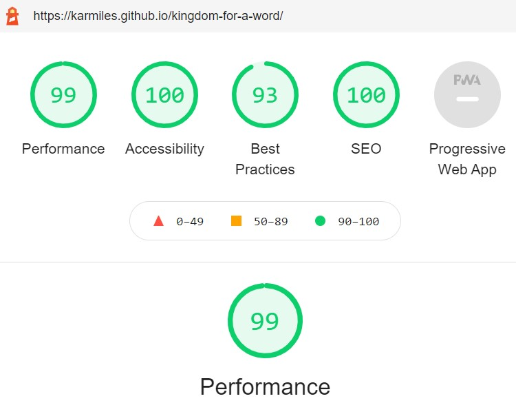

# Kingdom for a Word!
Developer: Karol Mileszko

[Live webpage](https://karmiles.github.io/kingdom-for-a-word/)

## Table of content

1. [Introduction](#introduction)
2. [Plane 1. Strategy](#plane-1-strategy)
    1. [Project Goals](#project-goals)
    2. [User Experience UX](#user-experience-ux)
        1. [User stories](#user-stories)
        2. [Focus](#focus)
3. [Plane 2. Scope](#plane-2-scope)
    1. [Objective requirements](#objective-requirements)
    2. [Functional specifications](#functional-specifications)
    3. [Content requirements](#content-requirements)
    4. [Project rollout](#project-rollout)
4. [Plane 3. Structure](#plane-3-structure)
    1. [Prioritisation](#prioritisation)
    2. [Semantic sections](#semantic-sections)
5. [Plane 4. Skeleton](#plane-4-skeleton)
6. [Plane 5. Surface](#plane-5-surface)
    1. [Design choices](#design-choices)
    2. [Colour](#colour)
    3. [Fonts](#fonts)
    4. [Structure](#structure)
7. [Technologies used](#technologies-used)
8. [Frameworks Libraries and Programs used](#frameworks-libraries-and-programs-used)
    1. [Tools used](#tools-used)
    2. [Features applied](#features-applied)
9. [Deployment](#deployment)
10. [Testing](#testing)
    1. [Validators](#validators)
        1. [W3C Markup Validator](#w3c-markup-validator)
        2. [W3C CSS JigSaw Validator](#w3c-css-jigsaw-validator)
    2. [User Experience UX testing](#user-experience-ux-testing)
        1. [Visibility and functionality](#visibility-and-functionality)
        2. [Accessibility](#accessibility)
        3. [Performance](#performance)
        4. [Browser compatibility](#browser-compatibility)
        5. [Testing user stories](#testing-user-stories)
        6. [Peer review](#peer-review)
11. [Bugs and changes to original design](#bugs-and-changes-to-original-design)
12. [Credits](#credits)
    1. [Code](#code)
    2. [Media](#media)
    3. [Acknowledgements](#acknowledgements)

## Table of content
...

## Introduction
**The idea for the project**

The purpose of this webpage is to entertain the visitor with a word game. The aim of the game is to enter a word similar in meaning to the one shown on the page. If the word entered by the visitor is contained in the English Thesaurus the visitor gets a point. Both succesful and failed guesses are scored and shown on the page.   

**Project preparation**

The site was designed using the Five Planes of User Experience approach. This document follows the steps taken during the preparation of the site, going from the most abstract to the most concrete.

# Plane 1 Strategy
## Project goals
### Owner goals
- Provide online entertainment in the form of a word game.

## User Experience UX

### User stories

First Time Visitor goals:

1. **End user goal:** As a First Time Visitor I want that the site is easy to use. **Owner goal:** As the site Owner I want to provide a game that is intuitive to use. **Acceptance criteria:** Game is easy to learn and immediately engaging. No lengthy instructions are necessary.

First Time or Returning Visitor Goals:

2. **End user goal:** As a Visitor I want entertainment which would benefit me in some way.  **Owner goal:** As the site Owner I want to provide additional value to user through an educational aspect of the game. **Acceptance criteria:** Game draws on widely accepted source of knowledge and lets user draw on that. 
3. **End user goal:** As a Visitor I want to know my progress in the game at all times. **Owner goal:**  As the site Owner I want to keep user engaged through a feedback mechanism. Build and maintain visitor loyalty through increased engagement. **Acceptance criteria:** Game provides score visible at all times. 
4. **End user goal:** As a Visitor I want to be able to access the game on various kinds of devices. **Owner goal:**  As the site Owner I want to maintain customer engagement in various kinds of situations, when stationary (pc screen) or on the move (tablets and smartphones). **Acceptance criteria:** Site utilizes mechanisms of responsive desing. 

### Focus
I calculated the Focus ratio by multiplying Importance and Viability and normalised the results. This enabled me to compare every Opportunity on a scale of 0-100%. The higher the number the more crucial it is for the Opportunity to be addressed. Importance and Feasibility spectrum is perfectly illustrated on Code Institute graph below; Opportunities with high factor of both importance and viability would find themselves on the top right corner of the graph (red area). 

    
Importance / Viability graph

    

| No. | Opportunity / problem                                        | Importance (1 - 5 most important) | Viability / Feasibility (1– 5 most difficult) | Focus ratio |
| --- | ------------------------------------------------------------ | --------------------------------- | --------------------------------------------- | ----------- |
| 1   | Provide entertainment for the visitor                        | 5                                 | 5                                             | 100%        |
| 2   | Provide a challenge in the knowledge of the English language | 4                                 | 5                                             | 80%         |
| 3   | Provide educational element in the English language          | 3                                 | 4                                             | 48%         |

Basing on the above analysis the initial roll-out follows on opportunities 1 through 3 as important and feasible and as such are addressed in the project. 

**Definition**
The website is a recreational site providing entertainment with educational elements within English language scope.

**Value**
Value for the owner is providing light-harted entertainment. 
Value for the visitor is engaging in a simple game with an educational element.

# Plane 2 Scope
## Objective requirements
The visitor wants a site which will provide entertainment and is easy to use.

## Functional specifications
- Site shows random words.
- Visitor enters words that are similar in meaning (or otherwise related to the shown word) using keyboard. 
- After pressing the Submit button or Enter key on keyboard by visitor the word is checked on it's appearance in the thesaurus. 
- Score of successful and unsuccessful tries is kept and shown on the page for the duration of the game.

## Content requirements
Website needs to contain:
- Explanation on nature of the game.
- Game part.
- Score.

## Project rollout
All opportunities listed in the Focus section are expected to be realized in the initial rollout.

# Plane 3 Structure
## Prioritisation
The elements of the project are prioritised in the following order:
1. Provide entertainment for the visitor
2. Provide a challenge in the knowledge of the English language
3. Provide educational element in the English language

## Semantic sections
Webpage has three main semantic sections: 
1. Header: contains the title of the game and doesn't change.
2. Main section: contains two subpages:
    * Introduction and difficulty choice
    * Game part with random word, text area for Visitor's word, Submit button and score.
3. Footer: containing links to Owner's social media platforms and information about the site.

# Plane 4 Skeleton

Site low-fidelity prototypes (wireframes) were created in three versions for various screen sizes: small/smartphone, medium/tablet and large/PC to maintain website responsiveness on various screen sizes:

    
Starting page

    

    
Game page

    

# Plane 5 Surface

## Design choices
The intention behind building the sensory design for the site is focusing on a light-harted approach to playing with words. Graphic design draws on historic letters and vintage paper. This design is in line with the name of the game "Kingdom for the Word!" losely based on the words in Shakespeare's play "Richard III". 

## Colour
Colour palette applied in the site is inspired by the looks of vintage paper and hand-written and gothic letters.

    
Colour palette

    

## Fonts
Fonts used on the website are 
- UnifrakturCook
- MedievalSharp
## Structure
The website is structured in a simple, user friendly manner. Starting page briefly explains rules of the game and lets the visitor chose level of the game. After chosing difficulty the game page shows. This is where the score is also shown. The player can always go back by clicking the title of the game.

# Technologies used
This project has been realised using the following technologies:
* HTML5
* CSS3
* JavaScript

# Frameworks Libraries and Programs used
## Tools used
This project has been realised using the following frameworks, programs and webpages:
* Git - for version control
* [GitHub](https://github.com/) - for storing the project's code and other files
* [Visual Studio Code](https://code.visualstudio.com/) - for writing the code and documents
* [Balsamiq](https://balsamiq.com/) - for wireframes creation
* [Google Fonts](https://fonts.google.com/)
* [Table to Markdown](https://tabletomarkdown.com) - for converting tables to markdown format.
* [W3 School](https://www.w3schools.com/) - for web development coding solutions
* [Stack Overflow](https://stackoverflow.com/) - for web development coding solutions
* [IrfanView](https://www.irfanview.com/) - for graphics editing
* [Pixlr](https://pixlr.com/) - for graphics editing

# Deployment
The site is deployed to GitHub pages, using also GitHub repository, GitHub clone and GitHub branch methods as needed. On local computer Visual Studio Code program was used.

GitHub deployment:
1. After logging in to GitHub go to chosen GitHub repository (GitHub Repository for this project: https://github.com/KarMiles/campervan-adventures),
2. Go to Settings (top right),
3. Select Pages (menu on the left),
4. In Source section select Branch: main,
5. After the page refreshes automatically the confirmation appears (in case of this project: Your site is published at https://karmiles.github.io/campervan-adventures/).

Repository may be forked in the following steps:
1. Go to GitHub repository,
2. Click Fork button (top right).

Steps for cloning repository:
1. Go to GitHub repository,
2. Click Code button (top right above files list),
3. Select cloning method option: HTTPS, SSH or GitHub CLI and click Copy button (right side of the text box) to copy URL to clipboard,
4. Open Git Bash (Git Bash can be downloaded from https://git-scm.com/downloads),
5. In Git Bash change working directory to the desired destination for the clone,
6. Type "git clone", paste URL for SSH method from the clipboard (in this project: git clone git&#8203;@github.com:KarMiles/kingdom-for-a-word.git) and press Enter.

# Testing
## Validators

The following validators were used for testing code correctness:
### W3C Markup Validator 

No errors or warnings were found by [W3C Markup Validator](https://validator.w3.org/)  throughout the site.

    
Home

    

    
Campervans

    

    
Garage

    

    
FAQ

    

    
Contact

    

    
404

    

### W3C CSS Jigsaw Validator

No errors were found by [W3C CSS Jigsaw Validator](https://jigsaw.w3.org/css-validator). Reported warnings are related to Bootstrap and Font Owesome solutions.

    
CSS Validation

    

    
Bootstrap

    

    
Font Owesome

    

## User Experience UX testing

### Visibility and functionality
Optimal visibility and functionality on various devices was tested throughout the production process and the finished product was tested using [Responsive Designs](http://ami.responsivedesign.is). Screen from this test is placed in the beginning of this document.

### Accessibility
Testing for accessibility of the site was carried out with the employment of [WAVE Web Accessibility Evaluation Tool](https://wave.webaim.org/). No errors were found. Alerts were addressed where needed.

    
Home

    

    Web accessibility alerts indicated a repeated links. These are important for optimal user experience in this case.

    
Campervans

    

    Alerts related to Campervans page indicated to repeated alternative texts in carousel. This is due to similar nature of images in the carousel.

    
Garage

    

    
FAQ

    

    
Contact

    

    
404

    

### Performance
Performance testing was done in [Lighthouse](https://developers.google.com/web/tools/lighthouse), part of the Google Chrome Developer Tools.
 All performance tests ended with score between 90-100.

    
Home

    

    
Campervans

    

    
Garage

    

    
FAQ

    

    
Contact

    

    
404

    

### Browser compatibility
The website was tested on browsers:
- Google Chrome
- Microsoft Edge
- Mozilla Firefox
- Opera

### Testing user stories
1.	As a First Time Visitor I want to see what holidays in a campervan look and feel like so that I can decide whether it's appealing to me. 

| Feature                                     | Action                                                               | Expected result                                     | Actual result |
| ------------------------------------------- | -------------------------------------------------------------------- | --------------------------------------------------- | ------------- |
| Carousel with pictures of campervans.       | Navigate to Campervans page, go through images.                      | See campervans with their important features shown. | As expected.  |
| Description of campervans.                  | Navigate to Campervans page, read descriptions.                      | Get accustomed with campervan features available.   | As expected.  |
| Accordion with answers to common questions. | Navigate to FAQ page, scroll through questions, read chosen answers. | Get clarification on common questions.              | As expected.  |

    
 Screenshots 

    
    
    
    
    

2. As a Visitor I want to contact Campervan Adventures to enquire about vehicle rental. 

| Feature                          | Action                                                                                | Expected result                                | Actual result |
| -------------------------------- | ------------------------------------------------------------------------------------- | ---------------------------------------------- | ------------- |
| Contact details on Contact page. | Navigate to Contact page and choose means of contact.                                 | Means of contact provided.                     | As expected.  |
| Google Maps directions.          | Navigate to Contact page and click on link to Google Maps or on map provided on page. | Get directions to company’s physical location. | As expected.  |

    
 Screenshots 

    
    

3.	As a Visitor I want to subscribe to email newsletter. 

| Feature          | Action                                                         | Expected result      | Actual result               |
| ---------------- | -------------------------------------------------------------- | -------------------- | --------------------------- |
| Newsletter form. | Navigate to Contact page, fill the Newsletter form and submit. | Enrol to newsletter. | As expected (in demo mode). |

    
 Screenshots 

    

4.	As a Visitor I want to check what is needed to have a holiday in a campervan. 

| Feature                                      | Action                                                               | Expected result    | Actual result |
| -------------------------------------------- | -------------------------------------------------------------------- | ------------------ | ------------- |
| Accordion with answers to related questions. | Navigate to FAQ page, scroll through questions, read chosen answers. | Get clarification. | As expected.  |

    
 Screenshots 

    

5.	As a Visitor I want to see what vehicles are available for rent and check for company's current offer.

| Feature                                                              | Action                                                                                              | Expected result                                    | Actual result |
| -------------------------------------------------------------------- | --------------------------------------------------------------------------------------------------- | -------------------------------------------------- | ------------- |
| Carousel with campervans photos and campervan descriptions.          | Navigate to Campervan page, see photographs and read descriptions of campervans available for rent. | Get accustomed with campervans and their features. | As expected.  |
| List of services available for campervan owners at company’s garage. | Navigate to Garage page, see services available.                                                    | Get accustomed with company’s services.            | As expected.  |

    
 Screenshots 

    
    
    
    

6. As a Visitor I want to rent a vehicle online. User story not realized in initial release as described in the analysis in the [Focus](#focus) section.

7. As the Site Owner I want that prospective clients have multiple ways to engage with the company. 

| Feature                          | Action                                                                                | Expected result                                              | Actual result               |
| -------------------------------- | ------------------------------------------------------------------------------------- | ------------------------------------------------------------ | --------------------------- |
| Contact details on Contact page. | Navigate to Contact page and choose means of contact.                                 | Means of contact provided.                                   | As expected.                |
| Google Maps directions.          | Navigate to Contact page and click on link to Google Maps or on map provided on page. | Get directions to company’s physical location.               | As expected.                |
| Newsletter form.                 | Navigate to Contact page, fill the Newsletter form and submit.                        | Enrol to newsletter.                                         | As expected (in demo mode). |
| Footer                           | At the bottom of the page click on chosen social media link.                          | Opens new window or tab with company’s social media profile. | As expected.                |

8.	As the Site Owner I want that in case a non-existent page is being pulled the negative impact on Visitor's experience is minimized. 

| Feature         | Action                                                         | Expected result                                                                           | Actual result |
| --------------- | -------------------------------------------------------------- | ----------------------------------------------------------------------------------------- | ------------- |
| Error 404 page. | When a non-existent page is called the Error 404 page appears. | In case of error the Error 404 page appears with a short message and a link to main page. | As expected.  |

    
 Screenshots 

    

9.	As the Site Owner I want that the Garage starts to generate additional revenue for the company. 

| Feature    | Action                                          | Expected result                                              | Actual result |
| ---------- | ----------------------------------------------- | ------------------------------------------------------------ | ------------- |
| Info-boxes | Navigate to Garage page to read about services. | Information about services provided by the garage presented. | As expected.  |

    
 Screenshots 

    

10.	As the Site Owner I want that the site is usable on all kinds of widely utilized devices and screens. 

| Feature                                               | Action                                                                                                                    | Expected result                                                                                     | Actual result |
| ----------------------------------------------------- | ------------------------------------------------------------------------------------------------------------------------- | --------------------------------------------------------------------------------------------------- | ------------- |
| Application of responsive design throughout the site. | Site checked for responsiveness on wide range of screens, internet browsers and for performance in performance validator. | All features adjust and maintain full functionality on wide range of screens, browsers and devices. | As expected.  |

# Bugs and changes to original desing
During realisation of the project the following obstacles were met and changes to original design introduced:
* Reference to a variable currentRandomWord didn't work, despite testing via console.log(currentRandomWord) showing appropriate value. Problem was in dot notation. Changing to traditional bracket notation solved the problem.
* Second modal on the page, containing feedback, was not working as expected. Decided on replacing modal with additional screen.
# Credits
## Code
[Bootstrap](https://getbootstrap.com) - email functionality
## Media

[Colormind](http://colormind.io) – color palette creation  

    
colour palette

    

[Font Awesome](https://fontawesome.com/) - sourcing icons

[Favicon Generator](https://favicon.io/favicon-generator/) - favicon creation

[Pikwizard](https://pikwizard.com/) - stock photographs

[Unsplash](https://unsplash.com) - stock photographs

[Biblioteka w Szkole](https://www.bibliotekawszkole.pl/) - source image for logo

[Code Institute](https://learn.codeinstitute.net/) - educational material

    
 feasibility-graph 

    

[Collins Dictionary](https://www.collinsdictionary.com/dictionary/english-thesaurus) - sourcing words for the game

Other media are property of the developer.
